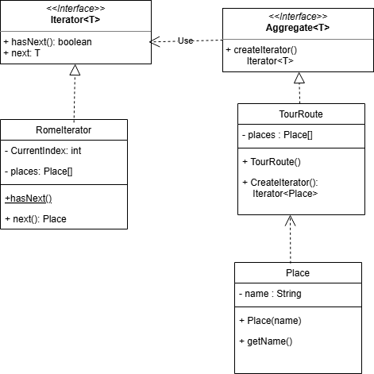

**¿Qué entendía mal antes?

Como se implementaban los patrones, confuncia su uso y su diagramacion

**¿Qué entiendo ahora?

Las diferencias y sus usos, especialmente su diagramacion, chain of responsability es el que mas se me queda

**¿Qué me falta reforzar?

Saber como implementar cual y en que casos hacerlo, por ejemplo con decorator, strategy, builder y las fabricas

### Diagrama ejercicio iterator
