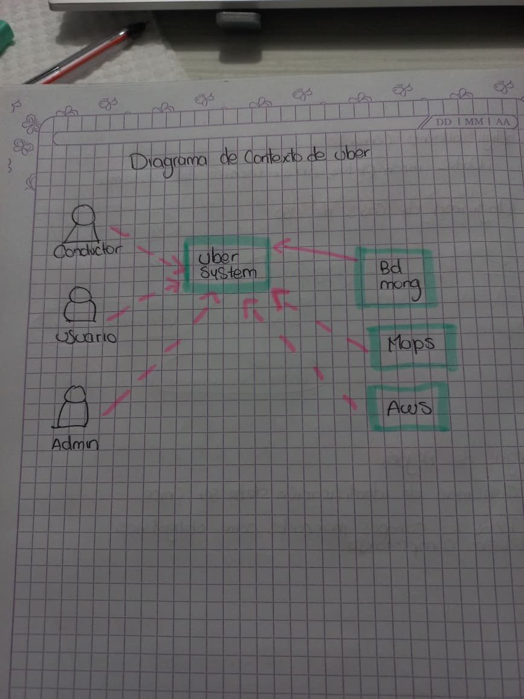
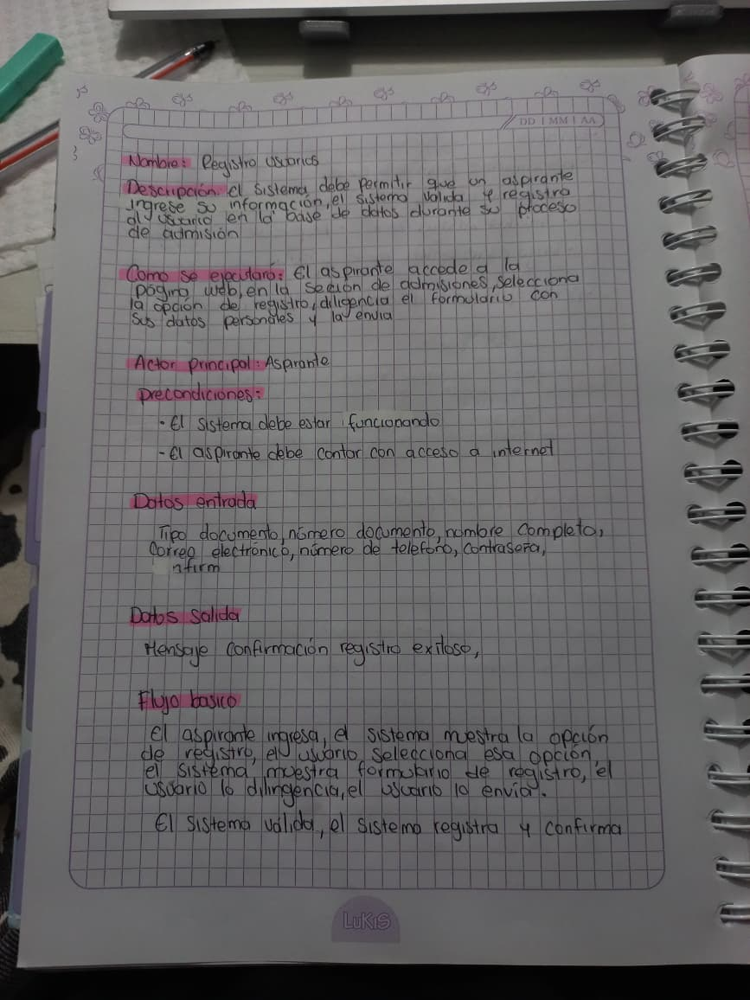
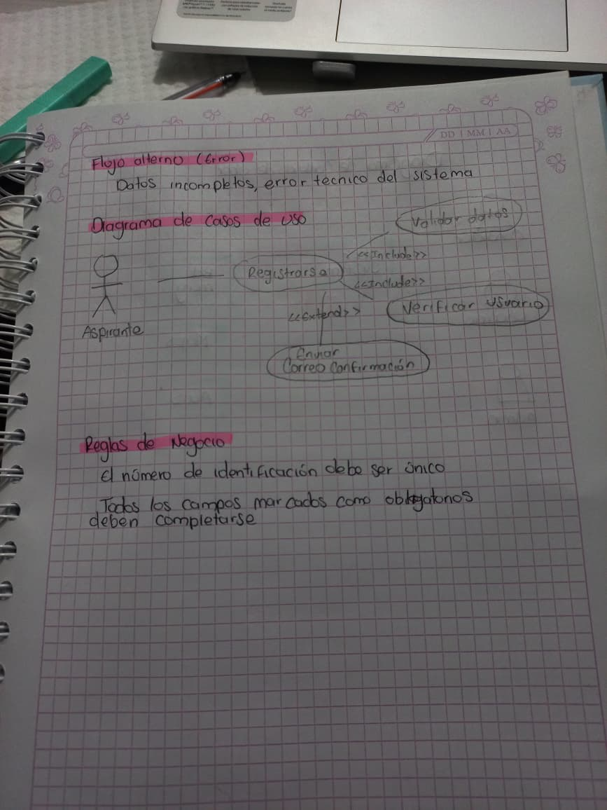

**¿Qué entendía mal antes?

No tenia muy claro conque proposito se hacian los diagramas de uso

**¿Qué entiendo ahora?

Lo importante de conocer un proyecto desde lo mas minimo

**¿Qué me falta reforzar?

Aun tengo dudas en las definiciones de requerimientos

### Diagrama de contexto Uber

### Ejercicio requerimientos

### Ejericio Manual de Identidad
