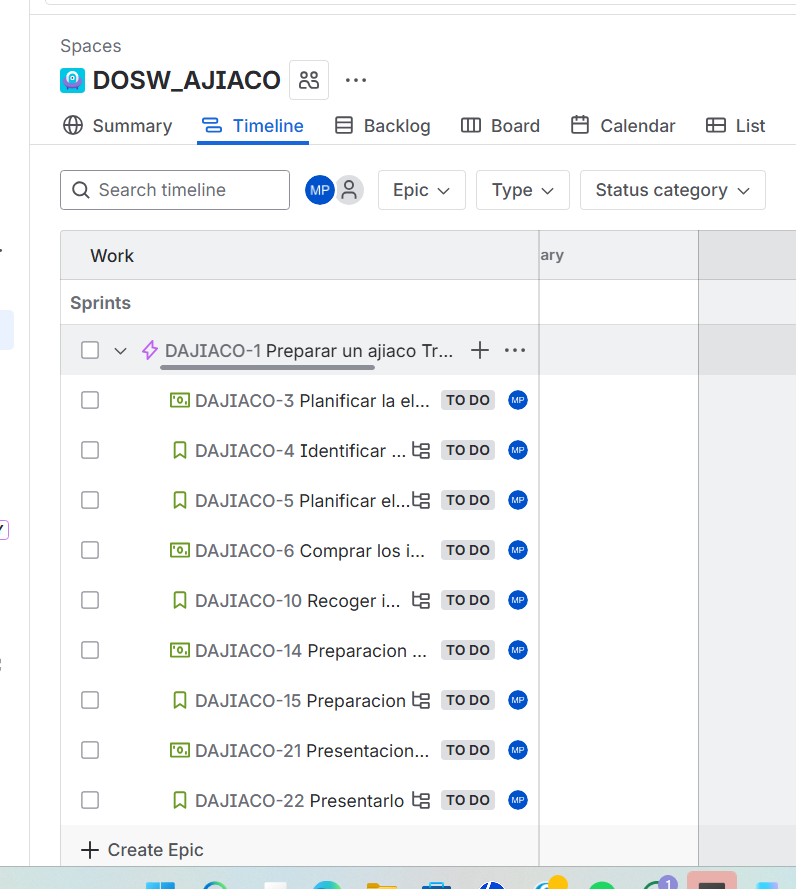
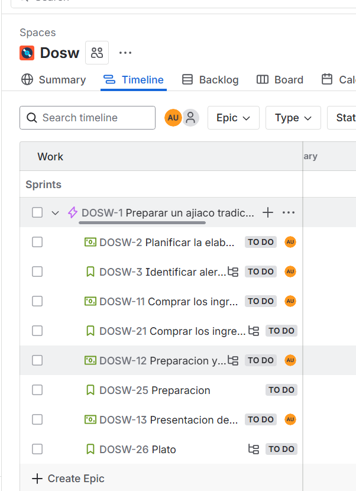

**¿Qué entendía mal antes?

No tenia conocimiento de los funcionamientos de Jira y por eso tuve que volver a crear el espacio porque se me borro

**¿Qué entiendo ahora?

Como se agregan los tipos de trabajo, como se crean las epics, feature, historias de uso y subtareas

**¿Qué me falta reforzar?
Lo de la estimacion de puntos y como manejar el orden de creacion

### Preparar un ajico
https://mail-team-u3ua8mon.atlassian.net/jira/software/projects/DAJIACO/boards/101/timeline?atlOrigin=eyJpIjoiMGI3NmJkMDAzY2I3NDI3M2IwNGJiNDA0ZDhjZTNkNjkiLCJwIjoiaiJ9

