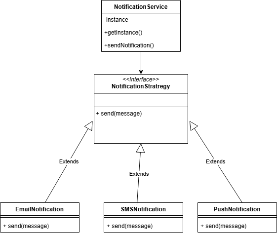
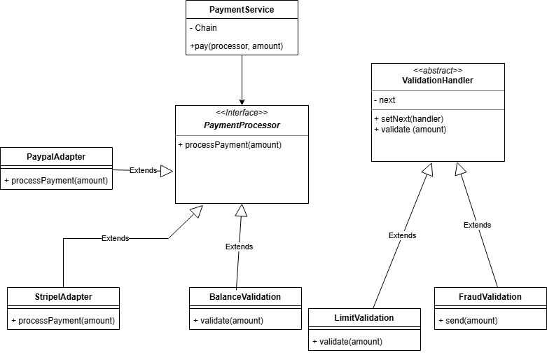
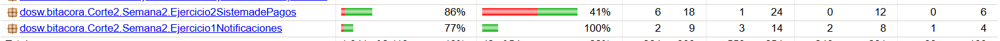
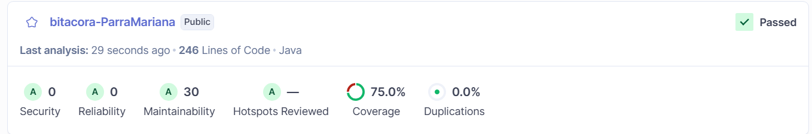

# Ejercicio1 Notificaciones

1. ### Strategy

   Tipo: Comportamiento

   Justificación:
    Permite cambiar dinámicamente el tipo de notificación (Email, SMS, Push) sin modificar el cliente.

2. ### Singleton

   Tipo: Creacional

   Justificación:
   Garantiza que exista una sola instancia del servicio de envío de notificaciones.

# Ejercicio 2 Sistema de pagos

1. ### Adapter

    Tipo: Estructural

    Justificación:
    Permite adaptar APIs externas (PayPal, Stripe, etc.) a una interfaz común.

2. ### Chain of Responsibility

   Tipo: Comportamiento

   Justificación:
   Permite ejecutar validaciones en cadena (fraude, saldo, límite).

# Cobertura jacoco
Al ejecutar las pruebas con JaCoCo obtuve cobertura por paquetes del sistema:

En Ejercicio 1: Notificaciones, la cobertura fue del 100% en métodos, lo que indica que todas las funcionalidades 
principales fueron probadas correctamente.
En Ejercicio 2: Sistema de Pagos, la cobertura fue del 86% en instrucciones, aunque la cobertura de ramas fue menor 
(41%), lo que indica que aún hay algunos caminos lógicos que no se están probando completamente.

# Cobertura SonarQube

Los resultados fueron:

Cobertura: 75.0%
Duplicación: 0.0%
Mantenibilidad: A
Sin errores ni vulnerabilidades
También se observa que el código está bien estructurado, sin duplicaciones y con buena mantenibilidad, lo que demuestra 
un uso adecuado de buenas prácticas y patrones de diseño.